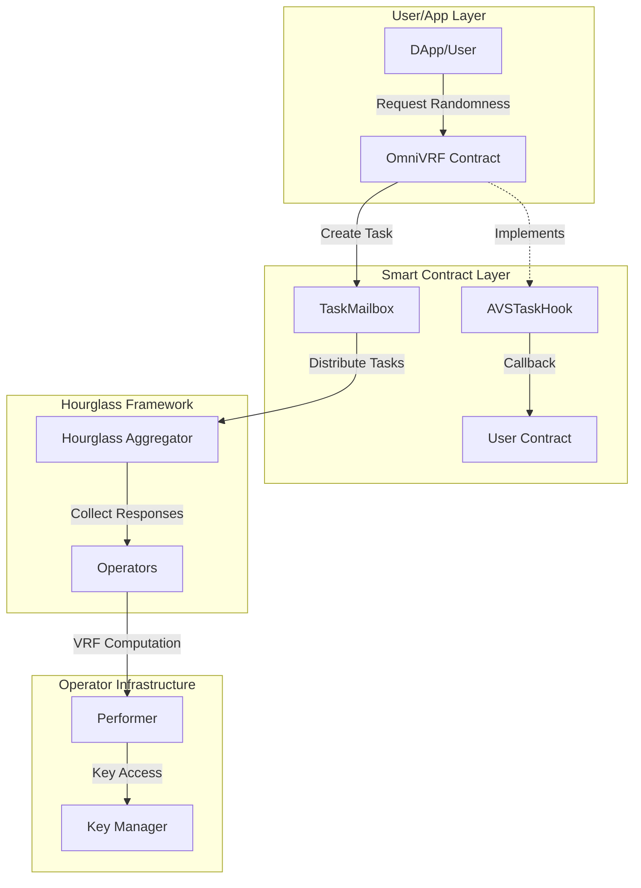

# OmniVRF: Verifiable Random Function AVS for EigenLayer Multichain

## Product Requirements & Technical Design Document

### Table of Contents
1. [Executive Summary](#executive-summary)
2. [System Overview](#system-overview)
3. [Architecture](#architecture)
4. [Smart Contract Design](#smart-contract-design)
5. [Off-chain Components](#off-chain-components)
6. [Security Considerations](#security-considerations)
7. [Implementation Plan](#implementation-plan)
8. [Testing Strategy](#testing-strategy)

---

## Executive Summary

OmniVRF is a Verifiable Random Function (VRF) service built as an Actively Validated Service (AVS) on EigenLayer's multichain infrastructure. It provides cryptographically secure, verifiable randomness to applications across Ethereum and Base (initially), with plans to expand to all L2s supported by EigenLayer multichain.

### Key Features
- **IETF VRF Standard Compliance**: Uses `github.com/vechain/go-ecvrf` for cryptographically secure randomness
- **Multichain Support**: Deploys on Ethereum mainnet and Base, expanding with EigenLayer multichain
- **Flexible Key Management**: Supports multiple secure key storage options
- **Callback Mechanism**: Optional async callbacks to consuming contracts
- **Gas-Efficient**: Aggregated responses minimize on-chain costs

---

## System Overview

### Components



### User Flow

1. User/App requests randomness from OmniVRF contract
2. OmniVRF creates task in TaskMailbox with optional callback
3. Hourglass Aggregator distributes task to all operators
4. Each operator computes VRF proof using their private key
5. Hourglass Aggregator collects responses and submits aggregated result
6. OmniVRF contract verifies and stores result
7. If callback specified, OmniVRF calls user contract with result

---

## Architecture

### Chain Architecture

Following [ELIP-008](https://github.com/eigenfoundation/ELIPs/blob/main/ELIPs/ELIP-008.md), OmniVRF will deploy across:

```yaml
Initial Chains:
  - Ethereum Mainnet (Source chain)
  - Base (Destination chain)

Future Expansion:
  - Arbitrum One
  - Optimism
  - Polygon zkEVM
  - [Other EigenLayer supported L2s]
```

### Component Architecture

```
┌─────────────────────────────────────────────────────────────┐
│                     Smart Contracts                          │
├─────────────────────────────────────────────────────────────┤
│ OmniVRF.sol                                      │
│   - Implements TaskMailbox pattern                          │
│   - Implements AVSTaskHook for callbacks                    │
│   - Manages randomness requests and callbacks               │
│                                                             │
│ IOmniVRF.sol                                       │
│   - Interface for contracts receiving callbacks             │
└─────────────────────────────────────────────────────────────┘

┌─────────────────────────────────────────────────────────────┐
│                    Off-chain Components                      │
├─────────────────────────────────────────────────────────────┤
│ VRF Performer (Go)                                          │
│   - Implements Hourglass Performer interface                │
│   - Computes VRF proofs using go-ecvrf                     │
│   - Flexible key management interface                       │
│                                                             │
│ Key Manager Interface                                       │
│   - Environment Variable Provider                           │
│   - AWS Secrets Manager Provider                           │
│   - Extensible for future providers                        │
└─────────────────────────────────────────────────────────────┘
```

---

## Smart Contract Design

### Core Contract: OmniVRF

```solidity
// SPDX-License-Identifier: MIT
pragma solidity ^0.8.19;

import {TaskMailbox} from "@eigenlayer/hourglass/TaskMailbox.sol";
import {AVSTaskHook} from "@eigenlayer/hourglass/AVSTaskHook.sol";

interface IOmniVRF {
    function fulfillRandomness(uint256 requestId, uint256 randomness) external;
}

contract OmniVRF is TaskMailbox, AVSTaskHook {
    struct RandomnessRequest {
        address requester;
        address callbackContract;
        uint256 callbackGasLimit;
        uint256 seed;
        uint256 blockNumber;
        bool fulfilled;
        uint256 result;
    }
    
    mapping(uint256 => RandomnessRequest) public requests;
    mapping(address => uint256) public callbackGasDeposits;
    
    uint256 public constant CALLBACK_GAS_PRICE = 10 gwei;
    uint256 public requestCounter;
    
    event RandomnessRequested(
        uint256 indexed requestId,
        address indexed requester,
        address callbackContract,
        uint256 seed
    );
    
    event RandomnessFulfilled(
        uint256 indexed requestId,
        uint256 randomness
    );
    
    /**
     * @notice Request verifiable randomness
     * @param callbackContract Optional contract to callback with result
     * @param callbackGasLimit Gas limit for callback (if provided)
     * @return requestId Unique request identifier
     */
    function requestRandomness(
        address callbackContract,
        uint256 callbackGasLimit
    ) external payable returns (uint256 requestId) {
        requestId = ++requestCounter;
        
        // If callback requested, ensure sufficient gas deposit
        if (callbackContract != address(0)) {
            uint256 requiredDeposit = callbackGasLimit * CALLBACK_GAS_PRICE;
            require(msg.value >= requiredDeposit, "Insufficient callback gas");
            callbackGasDeposits[msg.sender] += msg.value;
        }
        
        // Generate deterministic seed
        uint256 seed = uint256(keccak256(abi.encodePacked(
            msg.sender,
            requestId,
            block.prevrandao,
            block.timestamp
        )));
        
        // Store request
        requests[requestId] = RandomnessRequest({
            requester: msg.sender,
            callbackContract: callbackContract,
            callbackGasLimit: callbackGasLimit,
            seed: seed,
            blockNumber: block.number,
            fulfilled: false,
            result: 0
        });
        
        // Create task for operators
        bytes memory taskData = abi.encode(requestId, seed);
        _createTask(taskData, bytes32(requestId));
        
        emit RandomnessRequested(requestId, msg.sender, callbackContract, seed);
    }
    
    /**
     * @notice Hourglass hook called when task is completed
     */
    function onTaskCompleted(
        bytes32 taskId,
        bytes calldata result
    ) external override onlyAggregator {
        uint256 requestId = uint256(taskId);
        RandomnessRequest storage request = requests[requestId];
        
        require(!request.fulfilled, "Already fulfilled");
        
        // Decode aggregated VRF result
        (uint256 randomness, bytes memory proofs) = abi.decode(result, (uint256, bytes));
        
        // Verify VRF proofs (simplified for now)
        require(_verifyVRFProofs(request.seed, randomness, proofs), "Invalid VRF proofs");
        
        // Store result
        request.result = randomness;
        request.fulfilled = true;
        
        emit RandomnessFulfilled(requestId, randomness);
        
        // Execute callback if requested
        if (request.callbackContract != address(0)) {
            _executeCallback(requestId);
        }
    }
    
    function _executeCallback(uint256 requestId) internal {
        RandomnessRequest memory request = requests[requestId];
        
        // Deduct gas costs
        uint256 gasCost = request.callbackGasLimit * CALLBACK_GAS_PRICE;
        callbackGasDeposits[request.requester] -= gasCost;
        
        // Execute callback with gas limit
        try IOmniVRF(request.callbackContract).fulfillRandomness{
            gas: request.callbackGasLimit
        }(requestId, request.result) {
            // Success
        } catch {
            // Refund gas on failure
            callbackGasDeposits[request.requester] += gasCost;
        }
    }
    
    function _verifyVRFProofs(
        uint256 seed,
        uint256 result,
        bytes memory proofs
    ) internal pure returns (bool) {
        // TODO: Implement VRF proof verification
        // This will verify each operator's VRF proof
        return true;
    }
}
```

---

## Off-chain Components

### VRF Performer Implementation

```go
// performer/vrf_performer.go
package performer

import (
    "context"
    "crypto/ecdsa"
    "encoding/hex"
    "encoding/json"
    "math/big"
    
    "github.com/ethereum/go-ethereum/common"
    "github.com/ethereum/go-ethereum/crypto"
    "github.com/vechain/go-ecvrf"
    
    "github.com/layr-labs/hourglass/performer"
)

type VRFPerformer struct {
    keyManager KeyManager
    suite      *ecvrf.VRFSuite
}

type KeyManager interface {
    GetPrivateKey(ctx context.Context) (*ecdsa.PrivateKey, error)
    GetPublicKey(ctx context.Context) (*ecdsa.PublicKey, error)
}

type TaskData struct {
    RequestID *big.Int `json:"requestId"`
    Seed      []byte   `json:"seed"`
}

type TaskResponse struct {
    RequestID *big.Int `json:"requestId"`
    VRFProof  string   `json:"vrfProof"`
    VRFOutput string   `json:"vrfOutput"`
}

func NewVRFPerformer(keyManager KeyManager) *VRFPerformer {
    return &VRFPerformer{
        keyManager: keyManager,
        suite:      ecvrf.Secp256k1Sha256Tai, // Ethereum compatible
    }
}

// ProcessTask implements the Hourglass Performer interface
func (p *VRFPerformer) ProcessTask(ctx context.Context, task performer.Task) (performer.TaskResponse, error) {
    // Parse task data
    var taskData TaskData
    if err := json.Unmarshal(task.Data, &taskData); err != nil {
        return performer.TaskResponse{}, err
    }
    
    // Get VRF private key
    privKey, err := p.keyManager.GetPrivateKey(ctx)
    if err != nil {
        return performer.TaskResponse{}, err
    }
    
    // Compute VRF
    beta, pi, err := p.suite.Prove(privKey, taskData.Seed)
    if err != nil {
        return performer.TaskResponse{}, err
    }
    
    // Prepare response
    response := TaskResponse{
        RequestID: taskData.RequestID,
        VRFProof:  hex.EncodeToString(pi),
        VRFOutput: hex.EncodeToString(beta),
    }
    
    responseData, err := json.Marshal(response)
    if err != nil {
        return performer.TaskResponse{}, err
    }
    
    return performer.TaskResponse{
        TaskID: task.ID,
        Data:   responseData,
    }, nil
}

// Initialize implements Hourglass Performer interface
func (p *VRFPerformer) Initialize(ctx context.Context) error {
    // Verify key is accessible
    _, err := p.keyManager.GetPrivateKey(ctx)
    return err
}

// Cleanup implements Hourglass Performer interface
func (p *VRFPerformer) Cleanup(ctx context.Context) error {
    // Any cleanup needed
    return nil
}
```

### Key Manager Implementations

```go
// keymanager/env_key_manager.go
package keymanager

import (
    "context"
    "crypto/ecdsa"
    "encoding/hex"
    "errors"
    "os"
    
    "github.com/ethereum/go-ethereum/crypto"
)

type EnvKeyManager struct {
    privateKey *ecdsa.PrivateKey
    publicKey  *ecdsa.PublicKey
}

func NewEnvKeyManager() (*EnvKeyManager, error) {
    keyHex := os.Getenv("VRF_PRIVATE_KEY")
    if keyHex == "" {
        return nil, errors.New("VRF_PRIVATE_KEY not set")
    }
    
    keyBytes, err := hex.DecodeString(keyHex)
    if err != nil {
        return nil, err
    }
    
    privateKey, err := crypto.ToECDSA(keyBytes)
    if err != nil {
        return nil, err
    }
    
    return &EnvKeyManager{
        privateKey: privateKey,
        publicKey:  &privateKey.PublicKey,
    }, nil
}

func (m *EnvKeyManager) GetPrivateKey(ctx context.Context) (*ecdsa.PrivateKey, error) {
    return m.privateKey, nil
}

func (m *EnvKeyManager) GetPublicKey(ctx context.Context) (*ecdsa.PublicKey, error) {
    return m.publicKey, nil
}
```

```go
// keymanager/aws_key_manager.go
package keymanager

import (
    "context"
    "crypto/ecdsa"
    "encoding/hex"
    
    "github.com/aws/aws-sdk-go-v2/config"
    "github.com/aws/aws-sdk-go-v2/service/secretsmanager"
    "github.com/ethereum/go-ethereum/crypto"
)

type AWSKeyManager struct {
    client     *secretsmanager.Client
    secretName string
    cache      *ecdsa.PrivateKey
}

func NewAWSKeyManager(secretName string) (*AWSKeyManager, error) {
    cfg, err := config.LoadDefaultConfig(context.Background())
    if err != nil {
        return nil, err
    }
    
    return &AWSKeyManager{
        client:     secretsmanager.NewFromConfig(cfg),
        secretName: secretName,
    }, nil
}

func (m *AWSKeyManager) GetPrivateKey(ctx context.Context) (*ecdsa.PrivateKey, error) {
    if m.cache != nil {
        return m.cache, nil
    }
    
    result, err := m.client.GetSecretValue(ctx, &secretsmanager.GetSecretValueInput{
        SecretId: &m.secretName,
    })
    if err != nil {
        return nil, err
    }
    
    keyBytes, err := hex.DecodeString(*result.SecretString)
    if err != nil {
        return nil, err
    }
    
    privateKey, err := crypto.ToECDSA(keyBytes)
    if err != nil {
        return nil, err
    }
    
    m.cache = privateKey
    return privateKey, nil
}

func (m *AWSKeyManager) GetPublicKey(ctx context.Context) (*ecdsa.PublicKey, error) {
    privKey, err := m.GetPrivateKey(ctx)
    if err != nil {
        return nil, err
    }
    return &privKey.PublicKey, nil
}
```

### Main Application Entry Point

```go
// cmd/performer/main.go
package main

import (
    "context"
    "log"
    "os"
    
    "github.com/omnivrf/performer"
    "github.com/omnivrf/keymanager"
    "github.com/layr-labs/hourglass/executor"
)

func main() {
    // Determine key manager type
    var km performer.KeyManager
    var err error
    
    keyManagerType := os.Getenv("KEY_MANAGER_TYPE")
    switch keyManagerType {
    case "aws":
        secretName := os.Getenv("AWS_SECRET_NAME")
        km, err = keymanager.NewAWSKeyManager(secretName)
    default:
        km, err = keymanager.NewEnvKeyManager()
    }
    
    if err != nil {
        log.Fatalf("Failed to initialize key manager: %v", err)
    }
    
    // Create VRF performer
    vrfPerformer := performer.NewVRFPerformer(km)
    
    // Initialize Hourglass executor with our performer
    executor := executor.New(vrfPerformer)
    
    // Run executor
    if err := executor.Run(context.Background()); err != nil {
        log.Fatalf("Executor failed: %v", err)
    }
}
```

---

## Security Considerations

### Key Security
1. **Private Key Isolation**: VRF keys are separate from operator signing keys
2. **Multiple Storage Options**: Support for secure key management solutions
3. **Key Rotation**: Operators can update VRF public keys on-chain

### Randomness Security
1. **Unpredictability**: Combining all operator VRF outputs ensures no single operator can predict result
2. **Verifiability**: Each operator's VRF proof can be verified on-chain
3. **Non-biasability**: Operators must submit before seeing others' outputs

### Economic Security
1. **Slashing**: Operators can be slashed for:
    - Not responding to tasks
    - Providing invalid VRF proofs
    - Equivocation (different outputs for same input)
2. **Gas Protection**: Users prepay for callback gas to protect operators

---

## Implementation Plan

### Phase 1: MVP (Weeks 1-4)
- [ ] Basic smart contracts on Ethereum testnet
- [ ] VRF Performer with environment variable key manager
- [ ] Integration with Hourglass framework
- [ ] Basic testing suite

### Phase 2: Production Readiness (Weeks 5-8)
- [ ] AWS Secrets Manager integration
- [ ] On-chain VRF proof verification
- [ ] Gas optimization
- [ ] Security audit preparation

### Phase 3: Multichain Deployment (Weeks 9-12)
- [ ] Deploy to Ethereum mainnet
- [ ] Deploy to Base
- [ ] Cross-chain monitoring and analytics
- [ ] Operator onboarding documentation

### Phase 4: Enhancement (Weeks 13-16)
- [ ] Threshold VRF (subset of operators)
- [ ] Advanced key management options
- [ ] Performance optimizations
- [ ] Additional chain deployments

---

## Testing Strategy

### Unit Tests
```go
func TestVRFPerformer(t *testing.T) {
    // Test VRF computation
    // Test key manager integration
    // Test error handling
}
```

### Integration Tests
```solidity
function testRandomnessRequest() public {
    // Test request creation
    // Test callback execution
    // Test gas accounting
}
```

### End-to-End Tests
- Deploy full system on testnet
- Run operator set
- Submit randomness requests
- Verify callbacks and gas consumption

### Security Testing
- Fuzzing VRF inputs
- Testing operator misbehavior scenarios
- Gas griefing prevention
- Key compromise scenarios

---

## Appendix

### Monitoring Metrics
- Request volume per chain
- Response time distribution
- Operator participation rate
- Gas costs per request
- Callback success rate

### Operator Onboarding Guide

1. **Generate VRF Key**
   ```bash
   # Generate new secp256k1 key
   openssl ecparam -genkey -name secp256k1 -out vrf_key.pem
   
   # Extract private key in hex
   openssl ec -in vrf_key.pem -text -noout | grep priv -A 3 | tail -n +2 | tr -d '\n[:space:]:' > vrf_key.hex
   ```

2. **Configure Key Storage**
   ```bash
   # Option 1: Environment Variable
   export VRF_PRIVATE_KEY=$(cat vrf_key.hex)
   
   # Option 2: AWS Secrets Manager
   aws secretsmanager create-secret \
     --name omnivrf-operator-key \
     --secret-string $(cat vrf_key.hex)
   ```

3. **Run Operator**
   ```bash
   docker run -e KEY_MANAGER_TYPE=env \
              -e VRF_PRIVATE_KEY=$VRF_PRIVATE_KEY \
              omnivrf/operator:latest
   ```
